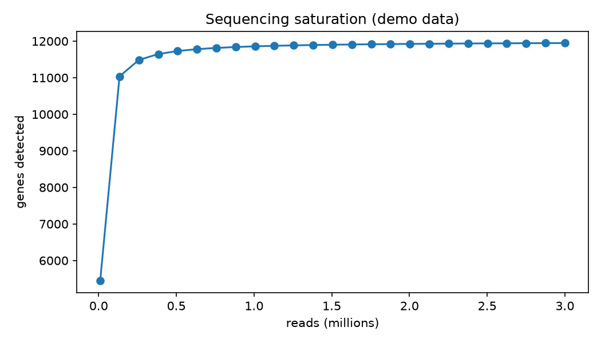

# Sequencing Saturation Curve

You can always pay for more sequencing depth — but at some point every extra read finds you almost no new genes. The saturation curve tells you exactly where that point is.

## Why This Matters

Deeper sequencing costs real money, and past a certain depth you are paying to re-detect genes you already found. The saturation curve — genes detected against reads spent — bends flat at the depth where more reads stop buying you information. Reading it stops you over-spending.

## How It Works

1. Model each gene's detection probability as a function of read depth.
2. Sweep depth from shallow to deep.
3. Plot genes detected against reads, and find where the curve plateaus.

## What the Demo Shows



The demo simulates 12,000 genes with a realistic skewed abundance and sweeps read depth. The curve rises steeply then flattens — the elbow is the depth beyond which extra reads are largely wasted.

## Run It

```bash
pip install -r requirements.txt
python demo.py
```

> Demonstrated on synthetic data, so it's fully reproducible with no external downloads.
